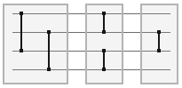

# Java API for Sorting Networks

This is a Java API with classes for exploring open questions about small sorting networks. Definitions, details, discussion, references, and suggestions for further reading are provided below. If you just want to know about the API classes and their methods, see the [API documentation](). Once the [wiki]() is posted, you can read about experiments and conjectures concerning sorting networks, or proposed extensions to the API.

## What is a Sorting Network?

First, what is a *comparison network*? There are two ways to look at it. Abstractly, a comparison network can be viewed as a sequence of *k* integer pairs that permutes a given list of *k* values. In particular, each pair indicates the positions in the list of two vlaues to be compared and, if out of order, swapped. More concretely, it can be visualized in a way that suggests a potential realization in hardware:

&nbsp;&nbsp;&nbsp;&nbsp;&nbsp;&nbsp;

The horizontal lines represent wires that carry data from left to right. Vertical lines denote *comparators*, logic gates that test the values on two wires and swap them if they are out of order. The shaded regions indicate groups of comparators that, having disjoint inputs, can operate in parallel. The size of a comparison network is defined to be the number of comparators, and its depth (or delay) is a measure of its comparison-level parallelism: the maximum number of comparators incident to a common wire. The network shown above has size 5 and depth 3. 

A sorting network is simply a comparison network that sorts every possible input sequence. It is a mathematical model of an oblivious sorting algorithm (that is, a sorting algorithm in which all comparisons take place in a fixed order at predetermined positions in the list).

## Known Constructions for Small Sorting Networks

## Open Questions

